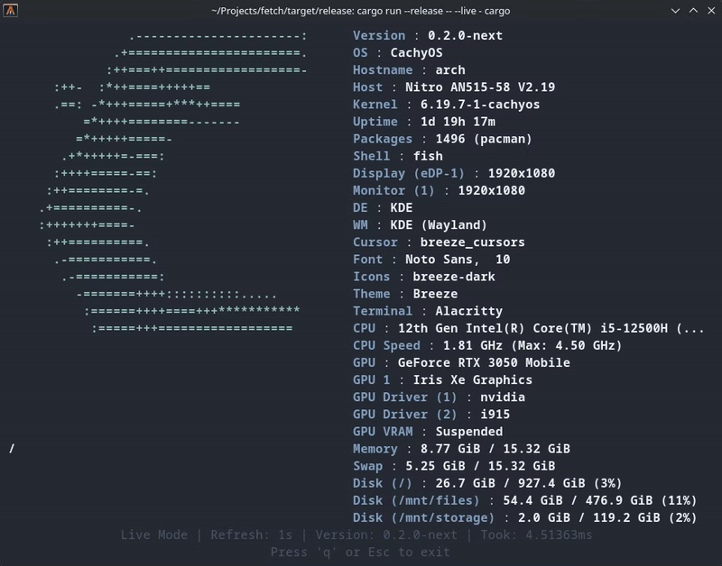
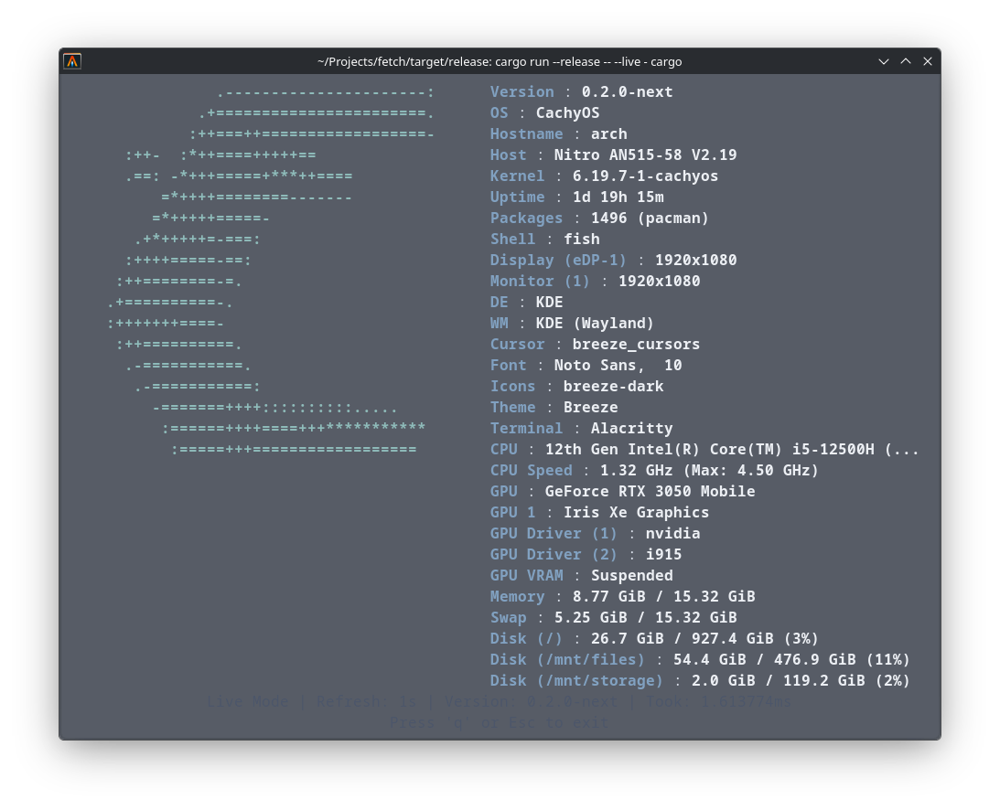
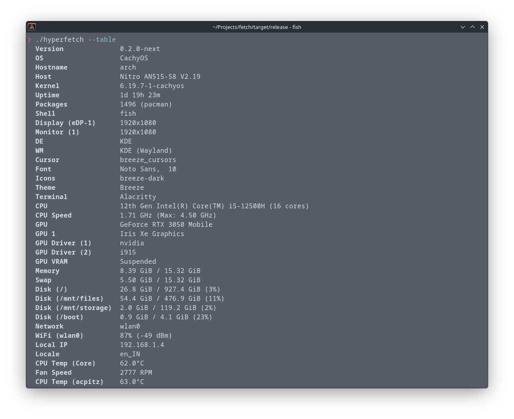
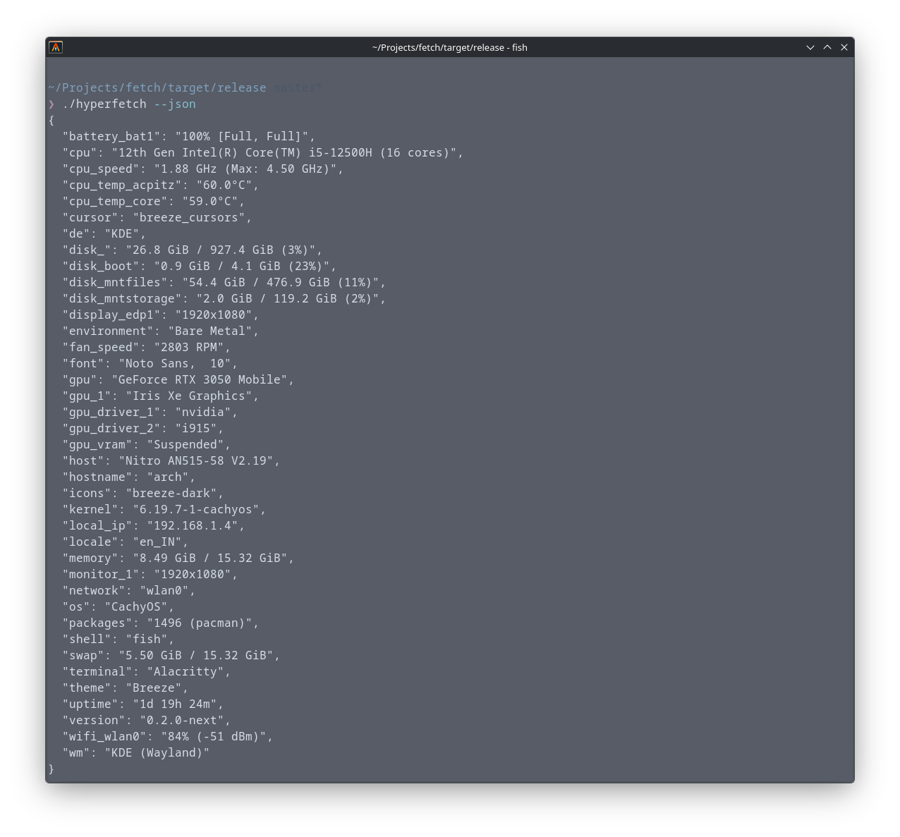

<div align="center">

# hyperfetch `v0.1.0`
**The industry's fastest system information tool, written in Rust.**




</div>

---

**hyperfetch** is an extremely fast and customizable system information tool that prioritizes **extreme performance, modern design, and clean output**.

## ✨ Features

* ⚡ **Extreme Performance** – Typical execution time in the **1.8 ms range**.
* 📺 **Live TUI Mode** – Real-time monitoring with a professional, centered TUI view (`--live`).
* 🧠 **Hardware Caching** – Efficiently benchmarks hardware once and caches expensive values.
* 🚀 **Deterministic Speed** – Built with optimized Rust for minimal overhead.
* ⚙️ **Fully Customizable** – Define your own modules, themes, and layouts via `config.toml`.
* 📦 **AUR Ready** – Native support for Arch Linux users.

---

## 📸 Showcase

<div align="center">
  
  
  <br>
  
</div>

---

## 📦 Installation

### Arch Linux (AUR)
Install using an AUR helper:
```bash
yay -S hyperfetch
```

### Build from Source
```bash
git clone https://github.com/revanthnemtoor/hyperfetch.git
cd hyperfetch
cargo build --release
```

---

## 🚀 Usage

### Standard Fetch
```bash
hyperfetch
```

### Live TUI Mode (Real-time monitoring)
```bash
hyperfetch --live
```
*   **Horizontal & Vertical Centering**: Automatically adapts to your terminal size.
*   **Flicker-Free**: Professional rendering using absolute positioning.
*   **Interactive**: Press `q` or `Esc` to exit.

---

## ⚡ Performance

| Tool           | Mean Time  |
| -------------- | ---------- |
| **hyperfetch** | **1.8 ms** |
| fastfetch      | 8.3 ms     |
| neofetch       | 569 ms     |

---

## 📄 License
MIT License | Copyright (c) 2026 Revanth Nemtoor
